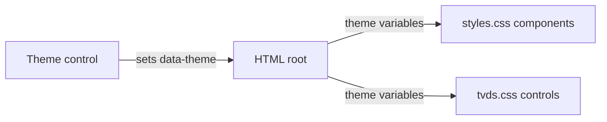

# Theme compliance audit

## Parts

| Part | Responsibility |
| --- | --- |
| `public/styles.css` | Owns the site-wide visual tokens and component surfaces. |
| `public/tvds.css` | Owns the responsive layout-preview and mobile navigation surfaces. |
| `public/tvds.js` | Applies the selected light or dark theme to the document root. |

## Change path

## Contract

`data-theme` is either `light` or `dark`; every component must derive foreground, background, borders, and emphasis from the matching token set rather than a dark-only literal.

## Audit scope

Correct dark-only component surfaces that remain after a light-theme switch, then validate both theme states on the live route. No storage, network API, or data-model changes apply.
